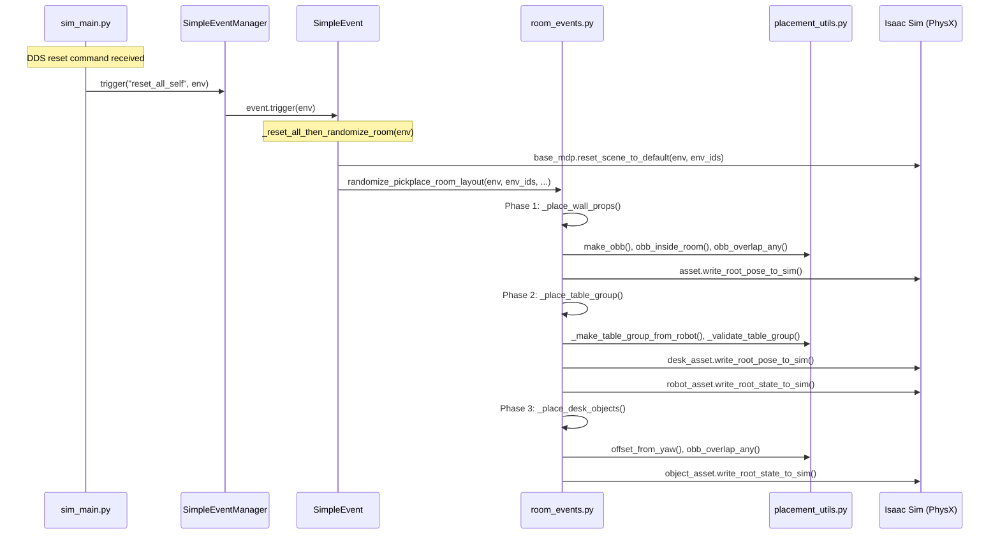
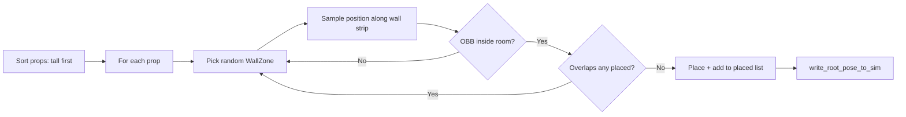
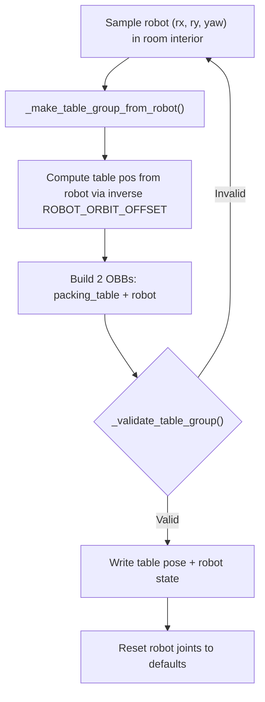
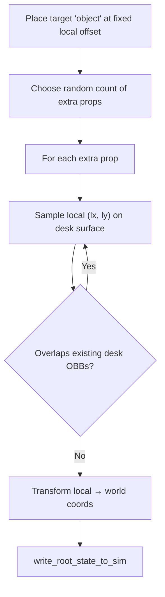

# Complete Analysis: Environment Randomizer in Pick & Place

## Current Integration Status

The randomizer is **fully integrated** into the **dex1** pick-and-place task variant:

| Task | Uses Randomizer? | Scene Class |
|------|:-:|---|
| [pick_place_cylinder_g1_29dof_dex1](file:///Users/cezarioa/Projects/core_unitree_sim_isaaclab/tasks/g1_tasks/pick_place_cylinder_g1_29dof_dex1/pickplace_cylinder_g1_29dof_dex1_joint_env_cfg.py) | ✅ | `RandomizedRoomPickPlaceSceneCfg` |
| [pick_place_cylinder_g1_29dof_inspire](file:///Users/cezarioa/Projects/core_unitree_sim_isaaclab/tasks/g1_tasks/pick_place_cylinder_g1_29dof_inspire/pickplace_cylinder_g1_29dof_inspire_env_cfg.py) | ❌ | `TableCylinderSceneCfg` (original) |

---

## Execution Flow



---

## Step-by-Step Walkthrough

### 1. Trigger Point — [sim_main.py:505](file:///Users/cezarioa/Projects/core_unitree_sim_isaaclab/sim_main.py#L496-L508)

During the sim loop, DDS reset commands trigger two event types:

```python
# reset_category == '1' → object-only reset
env_cfg.event_manager.trigger("reset_object_self", env)

# reset_category == '2' → full scene reset
env_cfg.event_manager.trigger("reset_all_self", env)
```

### 2. Event Registration — [dex1 env cfg:198-207](file:///Users/cezarioa/Projects/core_unitree_sim_isaaclab/tasks/g1_tasks/pick_place_cylinder_g1_29dof_dex1/pickplace_cylinder_g1_29dof_dex1_joint_env_cfg.py#L198-L207)

The dex1 task registers **two** events in `__post_init__`:

```python
# Object-only reset → re-randomize room without resetting scene defaults
self.event_manager.register("reset_object_self", SimpleEvent(
    func=_randomize_room_for_all_envs
))

# Full reset → reset to defaults THEN re-randomize room
self.event_manager.register("reset_all_self", SimpleEvent(
    func=_reset_all_then_randomize_room
))
```

> [!IMPORTANT]
> **Both events call `randomize_pickplace_room_layout`**, but `reset_all_self` first calls `base_mdp.reset_scene_to_default()` to restore all assets to their `init_state` positions before re-randomizing. This is critical because randomization moves assets far from their defaults.

### 3. The Two Event Wrapper Functions — [dex1 env cfg:51-70](file:///Users/cezarioa/Projects/core_unitree_sim_isaaclab/tasks/g1_tasks/pick_place_cylinder_g1_29dof_dex1/pickplace_cylinder_g1_29dof_dex1_joint_env_cfg.py#L51-L70)

```python
WALL_PROP_NAMES = [
    "medical_cabinet", "shelf_set", "supply_cabinet",
    "supply_cart_a", "supply_cart_b", "trash_can",
    "plant_a", "plant_b",
]
TABLE_PROP_NAMES = ["desk_lamp"]  # only desk_lamp as distractor

def _randomize_room_for_all_envs(env):
    randomize_pickplace_room_layout(
        env,
        torch.arange(env.num_envs, device=env.device),
        wall_prop_names=WALL_PROP_NAMES,
        table_prop_names=TABLE_PROP_NAMES,
        min_table_objects=1,
    )

def _reset_all_then_randomize_room(env):
    env_ids = torch.arange(env.num_envs, device=env.device)
    base_mdp.reset_scene_to_default(env, env_ids)
    randomize_pickplace_room_layout(env, env_ids, ...)
```

### 4. There's Also an `EventTermCfg` Declaration — [dex1 env cfg:150-159](file:///Users/cezarioa/Projects/core_unitree_sim_isaaclab/tasks/g1_tasks/pick_place_cylinder_g1_29dof_dex1/pickplace_cylinder_g1_29dof_dex1_joint_env_cfg.py#L149-L159)

```python
@configclass
class EventCfg:
    randomize_room_layout = EventTermCfg(
        func=randomize_pickplace_room_layout,
        mode="reset",
        params={
            "wall_prop_names": WALL_PROP_NAMES,
            "table_prop_names": TABLE_PROP_NAMES,
            "min_table_objects": 1,
        },
    )
```

> [!NOTE]
> This is the Isaac Lab native event system declaration. It coexists with the `SimpleEventManager` system. The `EventTermCfg` is triggered by Isaac Lab's built-in `EventManager` on environment reset (via `mode="reset"`), while the `SimpleEventManager` events are triggered manually by `sim_main.py` DDS commands. **Both paths call the same underlying function.**

---

## Scene Configuration — [RandomizedRoomPickPlaceSceneCfg](file:///Users/cezarioa/Projects/core_unitree_sim_isaaclab/tasks/common_scene/base_scene_randomized_pickplace_cfg.py#L109-L230)

vs. the original [TableCylinderSceneCfg](file:///Users/cezarioa/Projects/core_unitree_sim_isaaclab/tasks/common_scene/base_scene_pickplace_cylindercfg.py):

| Feature | Original Scene | Randomized Scene |
|---------|:---:|:---:|
| Room backdrop | Warehouse USD | Hospital Room Shell (`new_base_room.usda`) |
| Tables | 6 static packing tables | 1 movable packing table (kinematic rigid body) |
| Wall props | ❌ | 8 props (cabinets, carts, plants, trash can) |
| Tabletop distractors | ❌ | 3 objects (coffee cup, desk lamp, box) |
| Object spawner | `CylinderCfg` (static) | `CylinderCfg` (dynamic position via randomizer) |
| Prop spawner | — | `_spawn_real_rigid_usd` → custom USD spawner with `_kinematic_usd_cfg` |

### Key: Custom USD Spawner — [_spawn_real_rigid_usd](file:///Users/cezarioa/Projects/core_unitree_sim_isaaclab/tasks/common_scene/base_scene_randomized_pickplace_cfg.py#L64-L86)

Wall props and tabletop distractors are downloaded from the Omniverse CDN as detailed USD meshes. Since they have **no authored rigid bodies**, the custom spawner:
1. Spawns the visual mesh using `_spawn_from_usd_file`
2. Strips any child rigid body APIs (keeps only the root)
3. Authors a **kinematic** rigid body on the root prim
4. Ensures mesh colliders exist via `_ensure_mesh_colliders`

---

## The Randomizer: 3-Phase Algorithm — [room_events.py](file:///Users/cezarioa/Projects/core_unitree_sim_isaaclab/tasks/utils/room_randomizer/room_events.py#L132-L211)

### Entry Point: `randomize_pickplace_room_layout()`

```
randomize_pickplace_room_layout(env, env_ids, wall_prop_names, table_prop_names, min_table_objects)
```

**Pre-processing:**
1. **Hide duplicate visuals** — [`_hide_duplicate_visual_props()`](file:///Users/cezarioa/Projects/core_unitree_sim_isaaclab/tasks/utils/room_randomizer/room_events.py#L100-L125): The `new_base_room.usda` contains baked-in visual meshes for props (desk, chair, cabinets, etc.). These overlap with the separately spawned rigid-body versions. On first reset, they're hidden via `UsdGeom.Imageable.MakeInvisible()`.

2. **Despawn unused props** — [`_despawn_props()`](file:///Users/cezarioa/Projects/core_unitree_sim_isaaclab/tasks/utils/room_randomizer/room_events.py#L78-L97): Any wall/table prop defined in `constants.py` but NOT listed in the caller's `wall_prop_names`/`table_prop_names` is teleported to `z = -100`.

### Phase 1: Wall Props — [_place_wall_props()](file:///Users/cezarioa/Projects/core_unitree_sim_isaaclab/tasks/utils/room_randomizer/room_events.py#L259-L353)



- **Wall zones** are defined in [constants.py:67-84](file:///Users/cezarioa/Projects/core_unitree_sim_isaaclab/tasks/utils/room_randomizer/constants.py#L67-L84): 2 strips — back wall (X=-12 to -4, fixed Y≈-10.75) and right wall (Y=-10 to -7, fixed X≈-3.0)
- Tall props (cabinets, shelves) are placed first so they get priority on valid zones
- Each prop has allowed walls, wall offset, and yaw offset from [WALL_PROP_META](file:///Users/cezarioa/Projects/core_unitree_sim_isaaclab/tasks/utils/room_randomizer/constants.py#L136-L183)
- Up to 100 attempts per prop; despawns if all fail

### Phase 2: Table Group — [_place_table_group()](file:///Users/cezarioa/Projects/core_unitree_sim_isaaclab/tasks/utils/room_randomizer/room_events.py#L468-L600)



> [!IMPORTANT]
> **Robot-anchored sampling**: Unlike my original design, the actual code samples the **robot position first**, then derives the table position from it using the inverse of `ROBOT_ORBIT_OFFSET = (-0.15, -0.55)`. This is done in [_make_table_group_from_robot()](file:///Users/cezarioa/Projects/core_unitree_sim_isaaclab/tasks/utils/room_randomizer/room_events.py#L360-L378). The table yaw is always `robot_yaw - π/2`.

- Sampling box: X ∈ [-10, -5], Y ∈ [-9, -6] — see [constants.py:90-93](file:///Users/cezarioa/Projects/core_unitree_sim_isaaclab/tasks/utils/room_randomizer/constants.py#L90-L93)
- Up to 300 attempts; fallback to fixed position (-7.5, -7.5); full despawn if still fails
- Table OBB uses `half_w=1.10, half_d=0.65`, robot OBB uses `half_w=0.25, half_d=0.25`
- Robot-table overlap check is **skipped** (they're intentionally close) — see [L388](file:///Users/cezarioa/Projects/core_unitree_sim_isaaclab/tasks/utils/room_randomizer/room_events.py#L388)
- After placement, robot gets full state reset: `write_root_state_to_sim` + `write_joint_state_to_sim` + position/velocity targets

### Phase 3: Tabletop Objects — [_place_desk_objects()](file:///Users/cezarioa/Projects/core_unitree_sim_isaaclab/tasks/utils/room_randomizer/room_events.py#L607-L742)



- **Target cylinder** is placed at fixed local offset `OBJECT_TABLE_LOCAL_OFFSET = (-0.35, -0.15)` relative to desk center — see [constants.py:113](file:///Users/cezarioa/Projects/core_unitree_sim_isaaclab/tasks/utils/room_randomizer/constants.py#L113). This is **NOT randomized** — it always appears in the same relative position on the table.
- Distractor count is random: `rng.randint(min_table_objects, len(extra_names))`
- Currently only `desk_lamp` is active as a distractor (coffee_cup and box_portable are defined in the scene but excluded from `TABLE_PROP_NAMES`)
- Tabletop OBB margin is tighter: `DESK_OBJECT_MARGIN = 0.05m`

---

## Collision System — [placement_utils.py](file:///Users/cezarioa/Projects/core_unitree_sim_isaaclab/tasks/utils/room_randomizer/placement_utils.py)

All placement validation uses **Oriented Bounding Boxes** with the **Separating Axis Theorem**:

| Function | Purpose |
|---|---|
| [make_obb](file:///Users/cezarioa/Projects/core_unitree_sim_isaaclab/tasks/utils/room_randomizer/placement_utils.py#L23-L25) | Create OBB tuple `(cx, cy, half_w, half_d, yaw)` |
| [obb_corners](file:///Users/cezarioa/Projects/core_unitree_sim_isaaclab/tasks/utils/room_randomizer/placement_utils.py#L28-L40) | Compute 4 world-space corners from OBB |
| [obb_overlap](file:///Users/cezarioa/Projects/core_unitree_sim_isaaclab/tasks/utils/room_randomizer/placement_utils.py#L49-L76) | SAT overlap test with optional inflation margin |
| [obb_inside_room](file:///Users/cezarioa/Projects/core_unitree_sim_isaaclab/tasks/utils/room_randomizer/placement_utils.py#L79-L86) | Room bounds check (all 4 corners inside) |
| [obb_overlap_any](file:///Users/cezarioa/Projects/core_unitree_sim_isaaclab/tasks/utils/room_randomizer/placement_utils.py#L89-L94) | Check one OBB against a list of placed OBBs |
| [build_root_state](file:///Users/cezarioa/Projects/core_unitree_sim_isaaclab/tasks/utils/room_randomizer/placement_utils.py#L155-L173) | Build `(N, 13)` root state tensor from position + yaw |
| [offset_from_yaw](file:///Users/cezarioa/Projects/core_unitree_sim_isaaclab/tasks/utils/room_randomizer/placement_utils.py#L106-L119) | Rotate a local offset by yaw (scalar) |

The SAT works by projecting both boxes onto 4 test axes (2 edge normals per box). If any axis yields a gap, the boxes don't overlap.

---

## Coordinate System & Key Constants — [constants.py](file:///Users/cezarioa/Projects/core_unitree_sim_isaaclab/tasks/utils/room_randomizer/constants.py)

```
Room bounds (hospital room):
  X: [-13.0, -0.5]    (left wall to right wall)
  Y: [-11.25, -5.0]   (back wall to front)
  Z: 0.0 (floor)

Table sampling zone (interior):
  X: [-10.0, -5.0]
  Y: [-9.0, -6.0]

Key Z levels:
  FLOOR_Z = 0.0
  TABLE_Z = -0.2        (packing table surface)
  DESK_OBJECT_Z = 0.84  (objects on table)
  DESPAWN_Z = -100.0     (off-screen)
```

---

## Debug & Diagnostics

The code emits extensive `[PLACEMENT_DEBUG]` and `[PLACEMENT_ERROR]` messages to stdout:

| Tag | Meaning |
|---|---|
| `[PLACEMENT_DEBUG] env=N object=X pos=(...)` | Successful placement with OBB corners |
| `[PLACEMENT_DEBUG] env=N overlap_check a=X b=Y` | Pairwise overlap validation |
| `[PLACEMENT_ERROR] env=N object=X wall_prop_placement_failed` | Prop couldn't be placed after 100 tries |
| `[PLACEMENT_ERROR] env=N table_group placement_failed` | Table group failed after 300+300 tries |
| `[PLACEMENT_DEBUG] env=N hidden_room_shell_duplicates=K` | K duplicate meshes hidden in RoomShell |

Debug OBBs are also stored on the env object at `env._room_randomizer_debug_obbs` for visualization — see [room_events.py:177-210](file:///Users/cezarioa/Projects/core_unitree_sim_isaaclab/tasks/utils/room_randomizer/room_events.py#L177-L210).

---

## Write Strategy: `write_root_pose_to_sim` vs `write_root_state_to_sim`

| Asset Type | Write Method | Reason |
|---|---|---|
| Wall props (kinematic) | `write_root_pose_to_sim` | Avoids PhysX velocity errors for kinematic bodies |
| Tabletop distractors (kinematic) | `write_root_pose_to_sim` | Same reason |
| Target object (dynamic) | `write_root_state_to_sim` | Needs full state (position + velocity reset) |
| Robot (articulation) | `write_root_state_to_sim` + `write_joint_state_to_sim` | Needs full body + joint state |
| Packing table (kinematic) | `write_root_pose_to_sim` | Same as wall props |

This distinction is handled by [_write_root_pose_to_sim()](file:///Users/cezarioa/Projects/core_unitree_sim_isaaclab/tasks/utils/room_randomizer/room_events.py#L73-L75).

---

## Not Yet Integrated: Inspire Task

The [inspire variant](file:///Users/cezarioa/Projects/core_unitree_sim_isaaclab/tasks/g1_tasks/pick_place_cylinder_g1_29dof_inspire/pickplace_cylinder_g1_29dof_inspire_env_cfg.py) still uses the original scene and simple object jitter reset:

```python
# Still uses:
from tasks.common_scene.base_scene_pickplace_cylindercfg import TableCylinderSceneCfg

# Event is simple uniform random jitter around init position:
self.event_manager.register("reset_object_self", SimpleEvent(
    func=lambda env: base_mdp.reset_root_state_uniform(
        env, ..., pose_range={"x": [-0.05, 0.05], "y": [0.0, 0.05]}, ...)
))

# Full reset just resets to defaults, no room randomization:
self.event_manager.register("reset_all_self", SimpleEvent(
    func=lambda env: base_mdp.reset_scene_to_default(env, ...)
))
```
